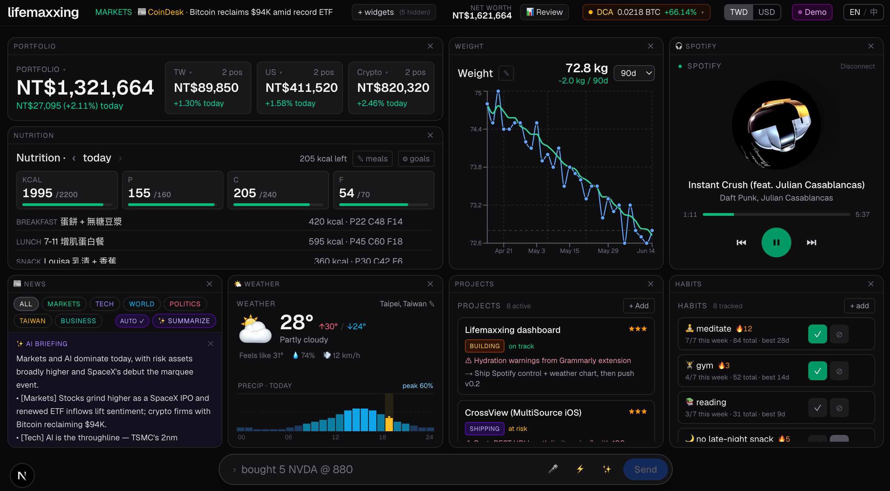

# Lifemaxxing Dashboard

A single-screen personal life dashboard. Investments (TW / US / crypto), nutrition, weight, weather, news, projects, habits, todos, Spotify playback, a read-later inbox, and "ask your data" natural-language SQL — all driven from one chat input parsed by a local [Hermes Agent](https://hermes-agent.nousresearch.com).



## What's special

- **One input, anything goes.** Type a trade, a meal, a weigh-in, a todo, a habit log, a recurring subscription, a cash balance, an URL to read later, or a question. The router picks the intent, the parser fills the fields, a confirmation pill lets you commit. Bare URLs and known meals fast-path past the LLM router for instant saves.
- **Ask your data.** Type a question (`"how much did I spend on coffee this month?"`, `"average protein on days I logged a gym habit"`) and Hermes returns safe read-only SQL → SQLite executes it → result renders inline above the input as a scalar pill or a table.
- **Widget docking.** Add or hide widgets from a slide-in sidebar (`+ widgets`). Drag, resize, persist via `react-grid-layout`. Pinned widgets are locked.
- **EN / 中 toggle.** UI flips between English and Traditional Chinese; persists per-browser. The MESSAGES dict in `src/lib/i18n.ts` is the source of truth.
- **Spotify control.** Connect your account, see the now-playing track with a spinning disc, scrub/play/pause/skip from the widget.
- **News briefing.** Auto-summarized headlines by category (Markets, Tech, World, Politics, Taiwan, Business) via Hermes — cached per category, toggle off if you want manual.
- **Weather hover.** Hover any precipitation bar to see exact `HH:00 · NN%` in a floating tooltip. The current-hour bar pops amber against the cool-blue rain bars.
- **Read later inbox.** Paste any YouTube / blog / tweet URL into the chat (optionally with `watch later` or `稍後看`) — it's saved with auto-fetched metadata (oEmbed for YouTube, `og:*` tags for everything else) and appears in the 📑 Read Later widget. Mark done / archive from hover actions.
- **Demo mode.** Toggle `Demo` in the navbar to fill the dashboard with realistic mock data for screenshots. Nothing touches your real DB.
- **Soft-delete everywhere.** Trades / meals / weights / links / projects all have an `archived_at` column. Nothing is ever hard-deleted from SQLite.

## Stack

- Next.js 16 (App Router, Turbopack) + React + TypeScript + Tailwind v4
- SQLite via `better-sqlite3` (`data/lifemaxx.db`)
- Local Hermes CLI invoked from API routes (`hermes -z "…" --yolo`) — used for the router, parsers, NL→SQL, and the news briefing
- `react-grid-layout` for widget docking, `recharts` for the weight line chart, hand-rolled SVG for the weather chart
- MSW + Vitest for tests (~308 passing across `lib`, `api`, `components` suites)

## Run

```bash
npm install
npm run dev
```

Open <http://127.0.0.1:3000> (Spotify OAuth requires `127.0.0.1`, not `localhost` — the project ships a `proxy.ts` that bounces `localhost:3000` → `127.0.0.1:3000` so either works).

Requires the [`hermes`](https://hermes-agent.nousresearch.com) CLI on `PATH`. The /api/log + /api/ask + /api/headlines/summary routes shell out to it.

### Spotify

Optional. Drop into `.env.local`:

```
SPOTIFY_CLIENT_ID=…
SPOTIFY_CLIENT_SECRET=…
```

And add `http://127.0.0.1:3000/api/spotify/callback` to your Spotify Developer Dashboard's allowed redirect URIs.

## Tests

```bash
npm test               # vitest run
npm test -- --watch    # vitest watch mode
```

## Layout

Single-viewport, no scroll. Default grid (drag and rearrange as you like — your layout persists):

- **Row 1:** Portfolio totals (TW / US / Crypto with today's P/L)
- **Row 2:** Nutrition (macros + meal log) · Weight (line chart + 7-day moving avg)
- **Row 3:** Projects (status, priority, current problem, next step)
- **Row 4:** News (auto-briefing + headline list) · Todos
- **Row 5:** Spotify · Weather · 📑 Read Later (toggle from `+ widgets`)
- **Pinned row at the bottom:** the chat input that powers everything

## API surface

Logging:
- `POST /api/log` — parse a free-text message, returns `{ kind, payload, needsConfirm }` or `{ kind: "answer", … }` for questions or `{ kind: "link", … }` for URL saves
- `POST /api/log/commit` — write the parsed entry (handles single + batch)
- `POST /api/ask` — NL → safe SELECT-only SQL (guarded by `lib/sql-guard.ts`) → execute → return rows

Data reads:
- `GET /api/portfolio` — positions with live prices (TW + US + crypto)
- `GET /api/nutrition?day=YYYY-MM-DD` — meals + macro totals + goals
- `GET /api/weights?days=N` — weigh-ins + 7d moving avg
- `GET /api/projects` — active projects sorted by priority
- `GET /api/todos` — open + recently completed
- `GET /api/habits` + `GET /api/habits/[id]/logs` — habits + per-day status
- `GET /api/networth` — cash + liabilities + total
- `GET /api/recurring` — subscriptions + DCA job summary
- `GET /api/headlines` + `GET /api/headlines/summary` — RSS pull + AI briefing
- `GET /api/links?status=unread|reading|done|all` — read-later inbox
- `GET /api/weather?place=…` — current + hourly precip + 7-day forecast
- `GET /api/spotify/now-playing` + `POST /api/spotify/control` — playback state + transport

Mutations on existing rows:
- `PATCH /api/trades/[id]`, `/api/meals/[id]`, `/api/weights/[id]`, `/api/todos/[id]`, `/api/projects/[id]`, `/api/habits/[id]`, `/api/subscriptions/[id]`, `/api/links/[id]`, `/api/cash-accounts/[id]`, `/api/liabilities/[id]`
- `DELETE /api/…/[id]` — soft archive (sets `archived_at`/`deleted_at`); never a hard SQL `DELETE`

## Project structure

```
src/
  app/
    api/         # one route folder per resource
    page.tsx     # the dashboard composition root (widget specs live here)
    layout.tsx   # shell + no-flash lang bootstrap
    globals.css  # tailwind + a few custom keyframes
  components/    # one .tsx per widget body (SpotifyPanel, WeatherPanel, ReadLaterPanel, DashboardLayout, …)
  lib/
    db.ts        # SQLite schema + idempotent migrations
    hermes.ts    # spawn the CLI, parse JSON from output
    prompts.ts   # router + every per-intent parser prompt
    sql-guard.ts # SELECT-only validation for /api/ask
    i18n.ts      # MESSAGES dict + useT() hook
    links.ts     # URL detection + metadata fetcher (YouTube oEmbed + og:* scrape)
    demo-data.ts # mock data installed by Demo toggle
    …
tests/
  api/           # per-route integration tests (in-memory DB + MSW)
  components/    # component render tests
  lib/           # pure-function unit tests
  setup.ts       # MSW server + global test config
```

## License

Personal project — no license, all rights reserved.
